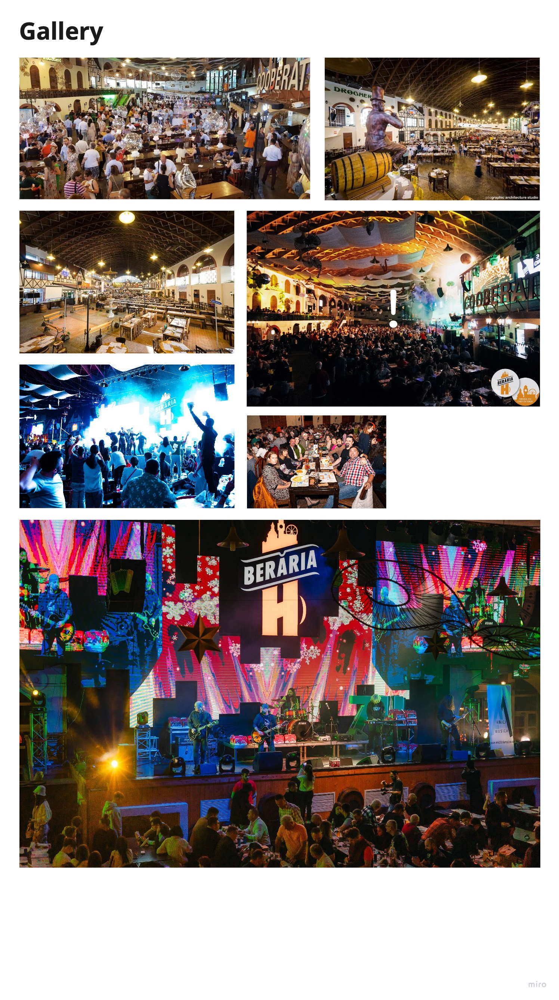

## Introduction
As many people have asked me what a day in my life working at Beraria H looks, I decided to write what was my experience there in a normal day.

## A day at the office
As working at Beraria H was hybrid, I will write about a day at the office there. 

- 10:00 - Arriving at the office; the marketing team comes in the office
- 10:10 - They order their morning coffee
- 10:30 - Everyone starts working on their projects
- 13:00 - Lunch with all the stuff
- 14:00 - Bands start rehearsing downstairs; I can hear the music from the office, really cool experience
- 14:30 - Asking the team about their ideas regarding their vision of the app
- 18:00 - Going home

## Gallery from Beraria H

