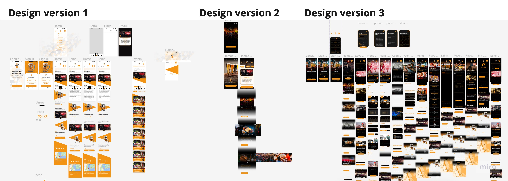
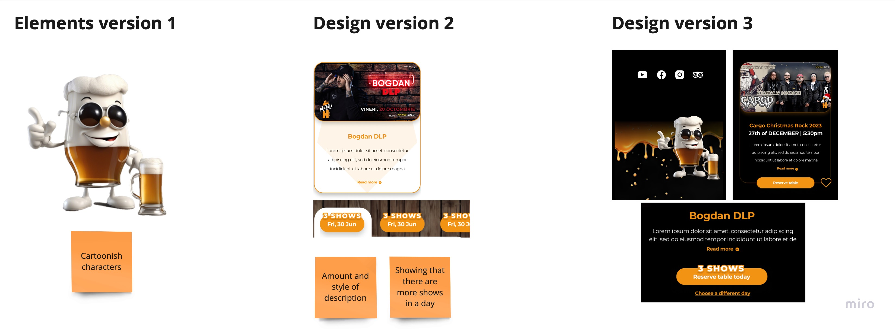
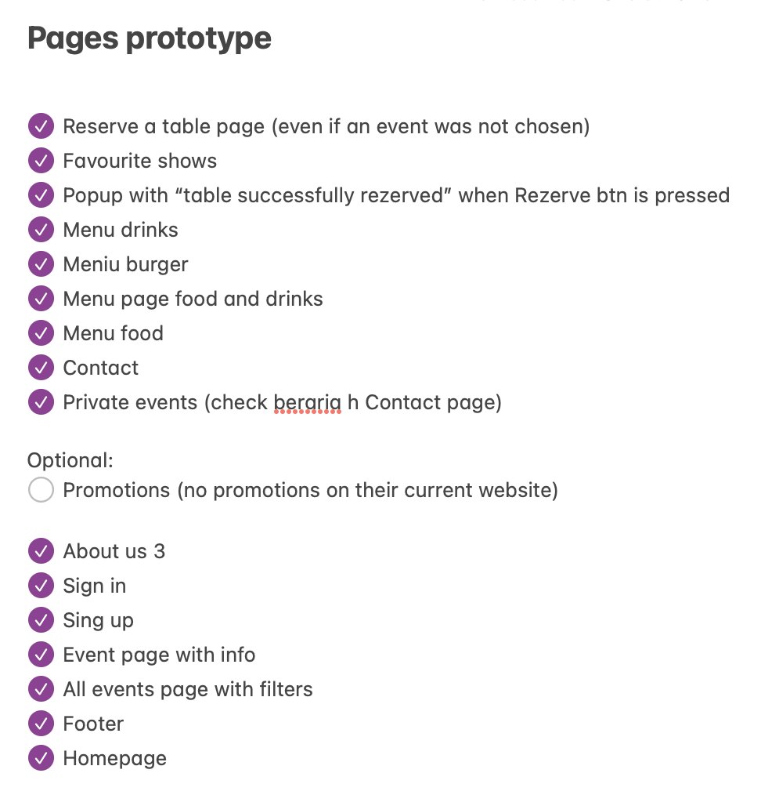

## Introduction
I used Figma as my main design tool when creating the user interface for the web application. You can click [this link](https://www.figma.com/file/YvT4znDvd3RzES22pEyV45/BerariaH-Scheduler-App?type=design&node-id=0%3A1&mode=design&t=698ULMTXIfplJgDL-1) to view the entire collection of designs. Robust research methods, including actual [user testing](https://git.fhict.nl/I476087/internship_berariah_s5_2023/-/wikis/Usertests) and iterative improvements targeted at improving the overall user experience, were carefully considered in the creation of these designs. Designing was more than just an artistic endeavour; it was a user-centered, strategic process that made sure that every pixel matched user preferences and expectations.

## Choosing the design path
I started the design process by making three different homepages in an attempt to find the best fit for the company's brand. After every iteration, I carefully gathered feedback.  The iterative process of this approach revealed that the third version offered an unmatched user experience, distinguished by smooth navigation, while also connecting most authentically with the brand's core values.

It's interesting to note that even though each prototype had distinct features that users found appealing, it was clear that the combination of these preferences could be used to improve the third version even more. As a result, the final design was a meticulous creation that took into account the strengths found in each prototype to create a homepage that not only captures the essence of the brand but also guarantees an easy-to-navigate and enjoyable user experience. The design that has resulted from this iterative refinement process, which was based on user feedback and preferences, harmoniously aligns with both the company's vision and user expectations.

### Strength found in each prototype

## Chosen prototype
I started organising the project to create a distinct beginning point after deciding which direction to take. This required creating a list of pages that needed to be designed, a process that was guided by an analysis of Beraria H's current website and a careful look at the features offered by competitors.  This tactical approach guaranteed a comprehensive understanding of the project scope and established the groundwork for a well-structured and competitive web application for Beraria H.

