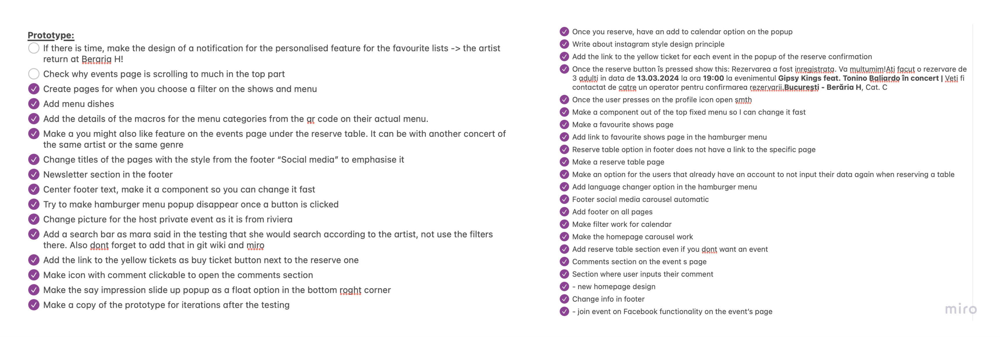
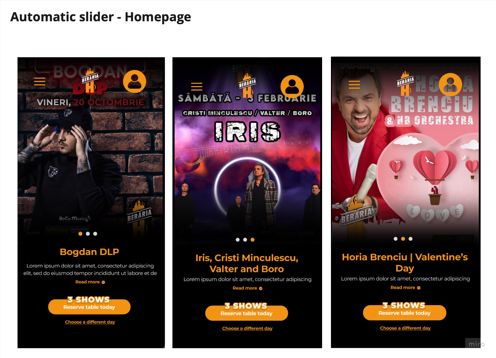
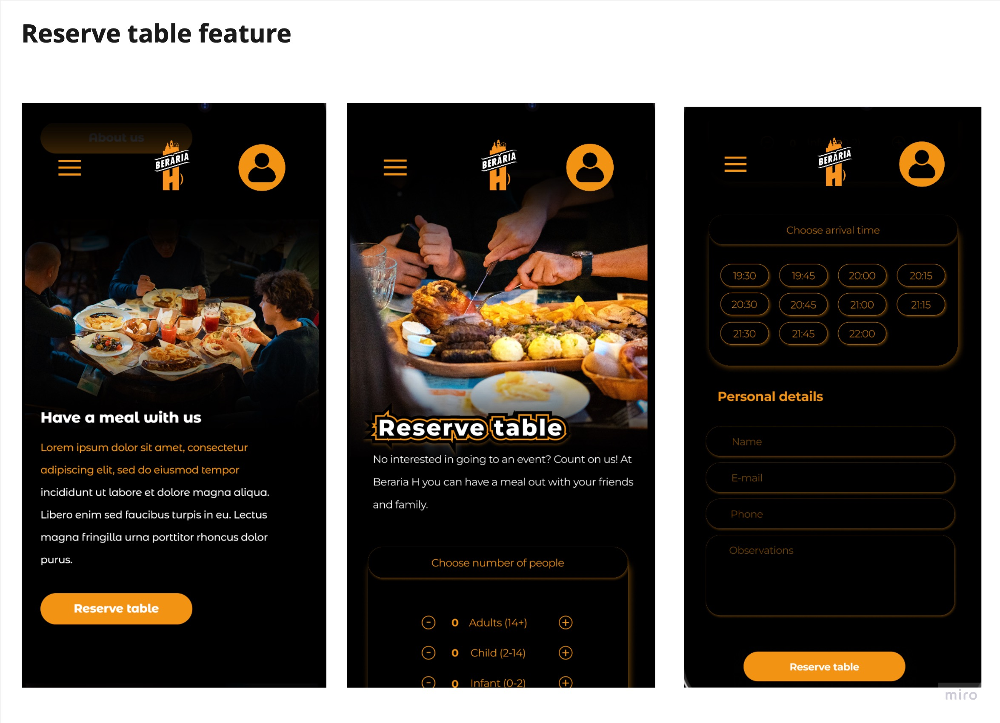
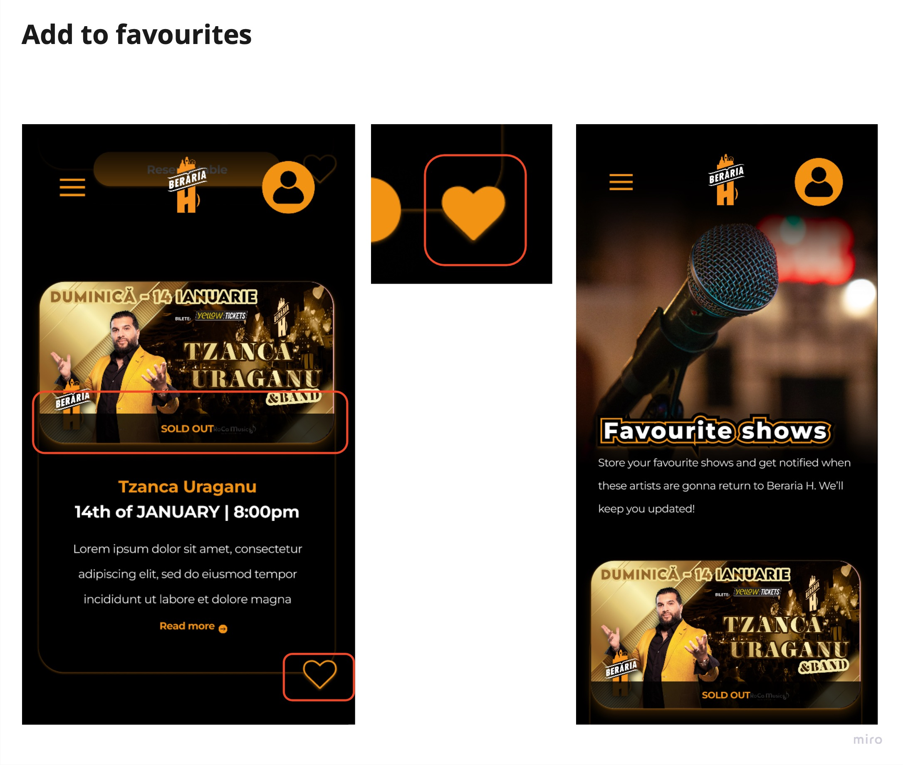
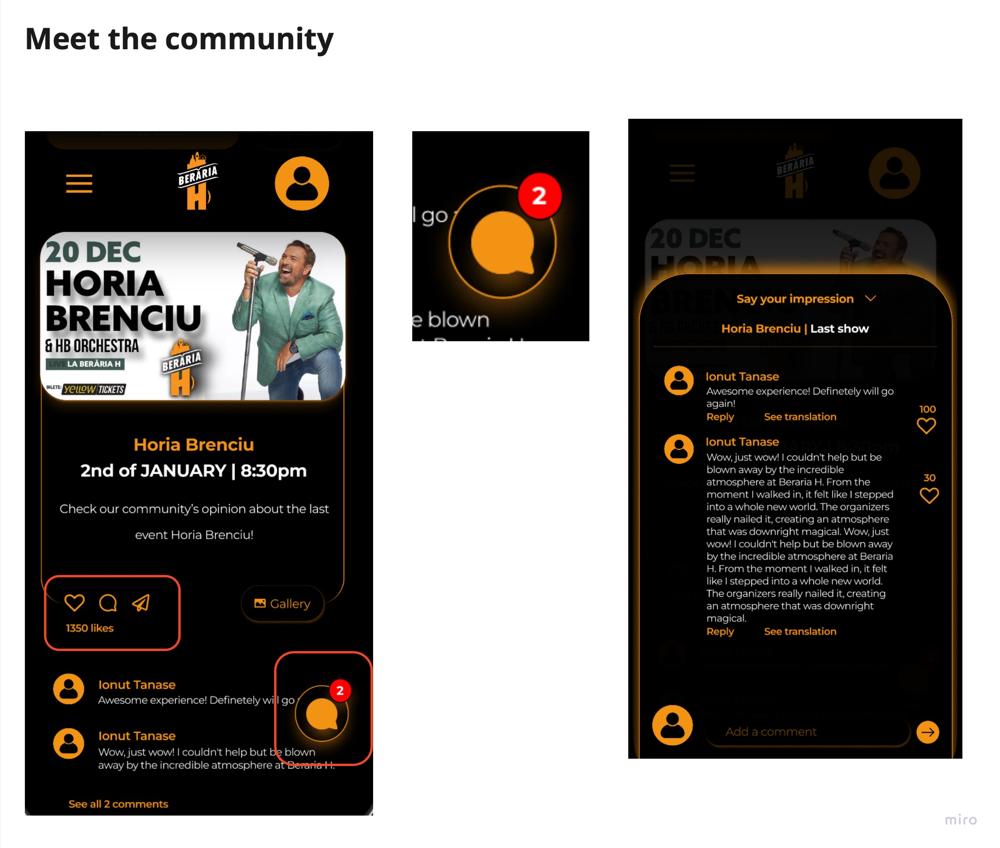
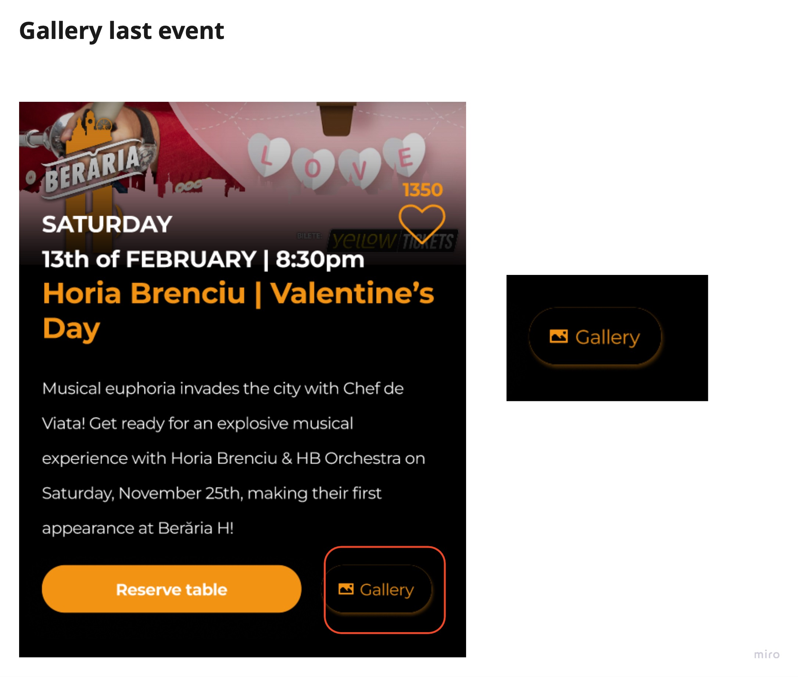
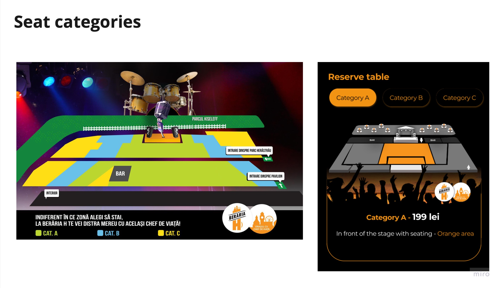
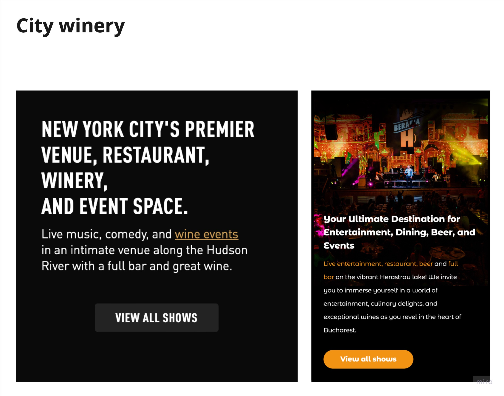
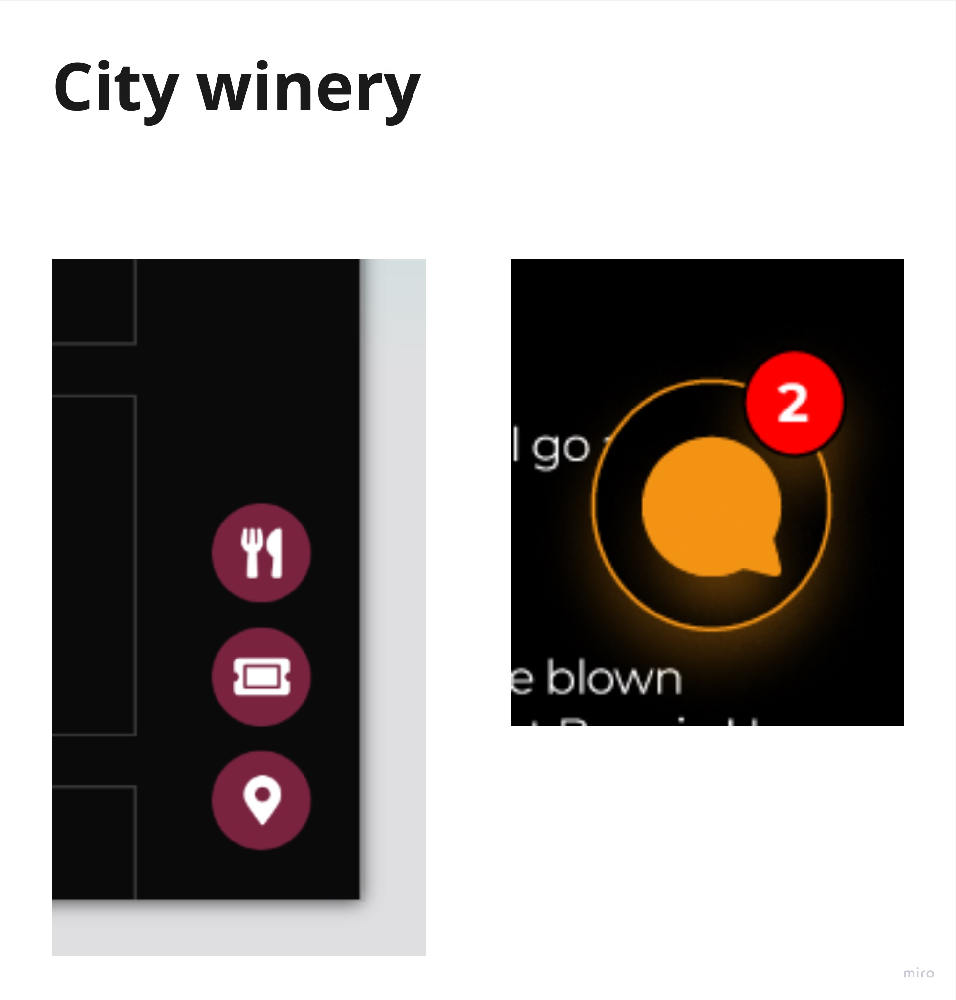
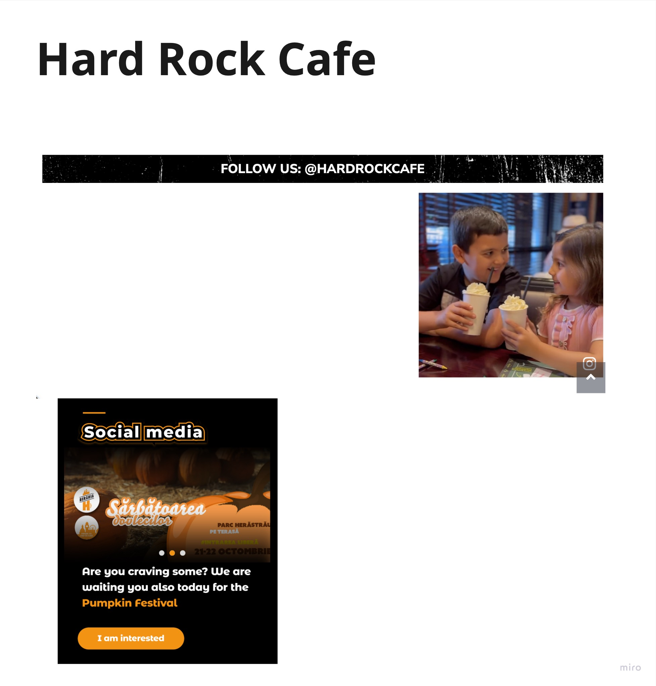

## Introduction
I used Figma as my main design tool when creating the user interface for the web application. You can click [this link](https://www.figma.com/file/YvT4znDvd3RzES22pEyV45/BerariaH-Scheduler-App?type=design&node-id=0%3A1&mode=design&t=698ULMTXIfplJgDL-1) to view the entire collection of designs. Robust research methods, including actual [user testing](https://git.fhict.nl/I476087/internship_berariah_s5_2023/-/wikis/Usertests) and iterative improvements targeted at improving the overall user experience, were carefully considered in the creation of these designs. Designing was more than just an artistic endeavour; it was a user-centered, strategic process that made sure that every pixel matched user preferences and expectations.

[**Figma demo**](https://www.figma.com/proto/YvT4znDvd3RzES22pEyV45/BerariaH-Scheduler-App?type=design&node-id=587-327&t=PyFh0o0ETKm4PKJO-1&scaling=scale-down&page-id=0%3A1&starting-point-node-id=587%3A327&show-proto-sidebar=1&mode=design)

## Choosing the design path
I started the design process by making three different homepages in an attempt to find the best fit for the company's brand. After every iteration, I carefully gathered feedback.  The iterative process of this approach revealed that the third version offered an unmatched user experience, distinguished by smooth navigation, while also connecting most authentically with the brand's core values.

It's interesting to note that even though each prototype had distinct features that users found appealing, it was clear that the combination of these preferences could be used to improve the third version even more. As a result, the final design was a meticulous creation that took into account the strengths found in each prototype to create a homepage that not only captures the essence of the brand but also guarantees an easy-to-navigate and enjoyable user experience. The design that has resulted from this iterative refinement process, which was based on user feedback and preferences, harmoniously aligns with both the company's vision and user expectations.

### Strength found in each prototype

## Personal organisation
I started organising the project to create a distinct beginning point after deciding which direction to take. This required creating a list of pages that needed to be designed, a process that was guided by an analysis of Beraria H's current website and a careful look at the features offered by competitors.  This tactical approach guaranteed a comprehensive understanding of the project scope and established the groundwork for a well-structured and competitive web application for Beraria H.

After that, I created a comprehensive list that captured all of the ideas that were circulating around my mind for features that would improve the app's usability. This exhaustive list served as an inspiration for enhancing the prototype, as I  converted them into concrete elements within the layout.

## Meeting stakeholders requirements

I started by concentrating on the specific features that the stakeholders had in mind for their future app, and then I thought about additional features that would enhance the overall customer-company experience.

### Implementation 1
I added an automatic slider to the homepage that would display all of the events "Today" along with a button that indicates the number of shows, as they wanted customers to be able to easily see that there are more events in a single day.

### Implementation 2
One crucial component of the design was the ability to reserve a table, even for users who aren't interested in going to a show. Realising how important it was, I added a "Sneak Peek" section right to the homepage. In addition, a special page was created to address this feature, guaranteeing a smooth and convenient booking process for individuals wishing to book a table without having to attend an event. This deliberate design decision highlights the company's dedication to offering flexible and accommodating features in the Beraria H web app while also improving accessibility.

## My own ideas
Following careful evaluation of the stakeholders' most pressing needs, I looked into and introduced new ideas to improve the project. The following are some features that came out during this creative stage:

### Personalised recommendations
I was determined to give the web application a personalised touch even though I didn't dive into the coding. The "Add to Favourites" feature was created as a result of this.

**Scenario: Let's say you're excited to see a particular artist perform live, but all the tickets are sold out. You may add them to your favourites list to be informed when they make future appearances at Beraria H. In this manner, you'll be informed when the artist comes back.**

### Meet the community
Understanding how important it is to build a sense of community, I added an Instagram-style comments section to the app. By sharing their experiences with the artist they are interested in, users can interact with others through this feature. Users can easily watch the most recent show in this section, along with interactive features like "Add to Favourites," "Leave a Comment," and "Share." This fosters a sense of community while simultaneously giving users an overview of the live performances that took place of their favourite artists. This helps users estimate the atmosphere and set expectations for what to expect.

Additionally, a persistent floating icon stays visible for the course of the scrolling experience, advising users continuously to the availability of this particular feature on the website. Additionally, this symbol further displays a number that indicates how many comments are present in that particular area. This design decision guarantees that users always know when a feature is available and gives them a quick overview of the level of interaction in the comment section.

### Gallery
Given that Beraria H's current website lacks any visual components other than event posters, I saw the potential benefit of providing users with a more immersive experience, particularly in terms of capturing the ambiance during performances. I added a "Gallery" button to each event page in order to address this. Users are automatically redirected to Magneto, an external website, upon clicking this button. This platform features an edited selection of excellent photos taken at the artist's most recent event by a professional photographer. The goal is to take viewers on a visual journey that will enhance their understanding and excitement for upcoming performances by giving them a peek of the distinct atmosphere and energy of the performances.

### Seats
On the current website of Beraria H, there is a seating plan, not that clear, that displays the seat categories. However, it is not visible, as there is only a link surrounded by a lot of text. That is why I came up with a solution of creating 3 different visuals according to the categories, that are displayed right where the user chooses the category.

## Competitor analyses ideas
After analysing the [competitors of Beraria H](url), I put aside all the features I could find that I thought would be good to add on Beraria H's website. 

### Feature 1
A homepage with multiple sections that would show all the pages that could be found on the whole website. This allows an easier browsing, so I thought it would great to add it on the website.

### Feature 2
A shortcut in the right bottom corner.

### Feature 3
A social media slider on the homepage showing some posts from the company's socials.

## What have I learnt?
This is the first time I made a prototype functional at this level. I learned how to work with the "Prototype" option, create overlays and use components. It is interesting how you can make the prototype almost identical to an actual website. 

However, making the design functional was not the difficult part. What was the hardest was thinking about creating a smooth process to actually make everything as easier as possible for users. Besides the testings made with the users, I also put myself in their shows, as I am a Beraria H client myself and did my best in thinking what would I like to find on their website.