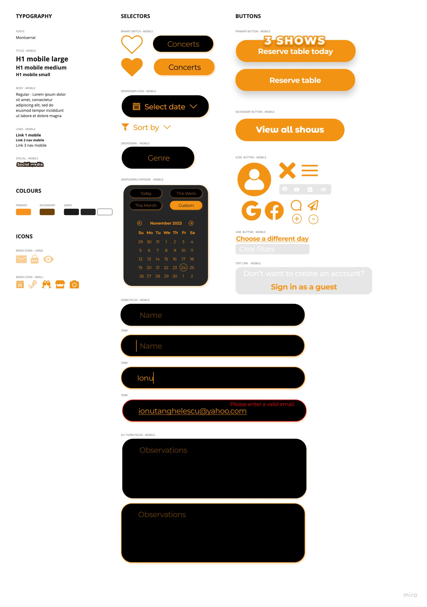

## Introduction 

My UI Style Guide serves as a comprehensive resource to ensure a consistent and aesthetically pleasing user interface for the Beraria H web app.

## Process

### Logo Usage Guidelines
Considering Beraria H's dedication to preserving the authenticity of their established visual identity, especially their logo, this UI Style Guide carefully avoided suggesting changes to the current logo design. Because Beraria H has a well-established brand, the decision not to perform logo alterations was made with the strategic goal of maintaining brand continuity and recognition.  Thus, the primary focus of this style guide is on optimising and improving the web application's design aspects in order to maintain the pre-established brand rules and provide a smooth user experience.
 That is why 