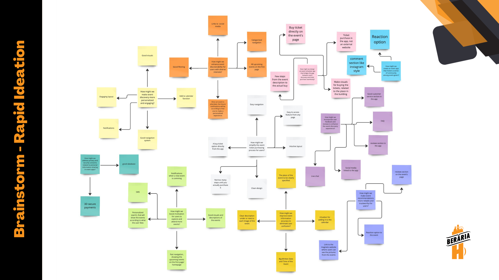

[Link to my Miro board](https://miro.com/app/board/uXjVMj2Vrlo=/?share_link_id=793269786459)

As I transitioned into the Define phase of the Double Diamond methodology, the pivotal moment had arrived for me to solidify a well-defined concept. In pursuit of this objective, I leveraged the invaluable insights gleaned from my meticulous research endeavors throughout the Discover phase. These insights provided a solid foundation upon which to build a concrete and purposeful project direction.

## Brainstorming Techniques

### Technique 1: Rapid Ideation

To initiate the ideation phase, I proactively sought out effective brainstorming techniques to facilitate idea generation. One such technique, known as "Rapid Ideation," caught my attention. In this approach, a predetermined time limit is set to encourage the generation of a multitude of ideas. In preparation, I had formulated a set of How-Might-We questions, which were meticulously organized using Miro, a collaborative online platform. Subsequently, I dedicated a focused two-minute interval to conceive a response for each question. The process was systematically structured to promote creativity and innovation, aligning with the research foundation established earlier.

