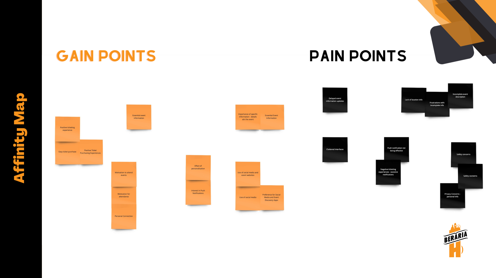
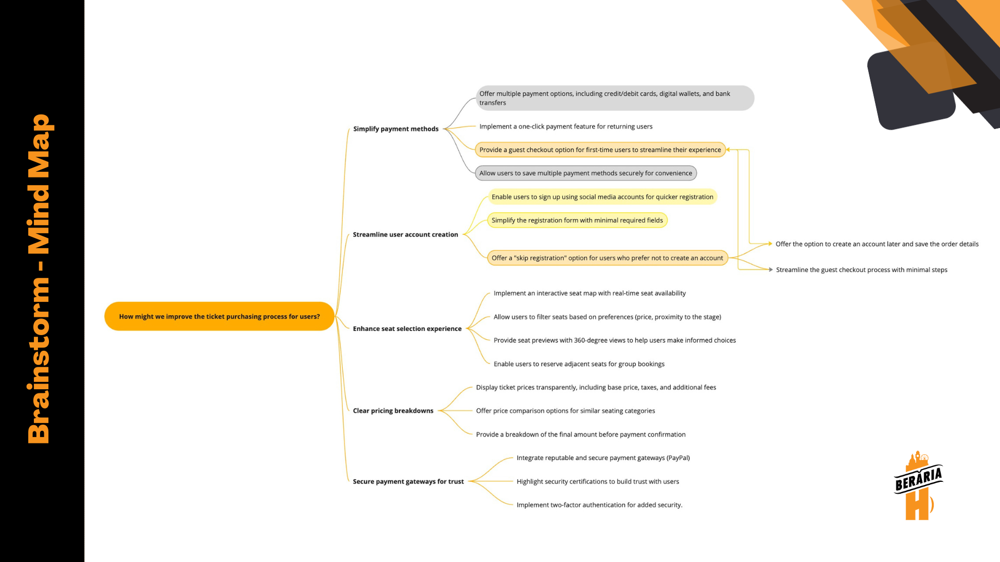

[Link to my Miro board](https://miro.com/app/board/uXjVMj2Vrlo=/?share_link_id=793269786459)

As I transitioned into the Define phase of the Double Diamond methodology, the pivotal moment had arrived for me to solidify a well-defined concept. In pursuit of this objective, I leveraged the invaluable insights gleaned from my meticulous research endeavors throughout the Discover phase. These insights provided a solid foundation upon which to build a concrete and purposeful project direction.

## Affinity map

Following the comprehensive [interviews](https://git.fhict.nl/I476087/internship_berariah_s5_2023/-/wikis/Written-Interviews) conducted, a discernible pattern of pain points and gains among participants emerged. Recognizing the value of organizing these insights systematically, I opted to construct an affinity map. This strategic visualization served as a vital precursor to the subsequent brainstorming session. By charting the key findings within the affinity map, I could synthesize a cohesive understanding of the challenges and opportunities, which, in turn, facilitated the generation of well-informed solutions to address these issues effectively. This approach ensured that the subsequent ideation phase was grounded in a solid foundation of user insights and research findings.

## Brainstorming Techniques

### Technique 1: Rapid Ideation

To initiate the ideation phase, I proactively sought out effective brainstorming techniques to facilitate idea generation. One such technique, known as "Rapid Ideation," caught my attention. In this approach, a predetermined time limit is set to encourage the generation of a multitude of ideas. In preparation, I had formulated a set of How-Might-We questions, which were meticulously organized using Miro, a collaborative online platform. Subsequently, I dedicated a focused two-minute interval to conceive a response for each question. The process was systematically structured to promote creativity and innovation, aligning with the research foundation established earlier.

### Technique 2: Mind Map

In response to the need for a more comprehensive exploration of brainstorming ideas, I opted for the creation of a mind map, an invaluable tool for organizing thoughts and fostering creativity. This visual representation of interconnected ideas serves as a pivotal resource for brainstorming, problem-solving, and strategic planning. Leveraging insights gained from previous research endeavors, particularly the findings from the Rapid Ideation phase, this mind map offers enhanced clarity regarding feature prioritization for the event ticket purchasing process. Addressing a prominent issue identified during the BerariaH project, lack of an integrated ticketing feature, the mind map employs color-coded fields to intuitively cluster related solutions, thereby facilitating a more cohesive and insightful overview.

