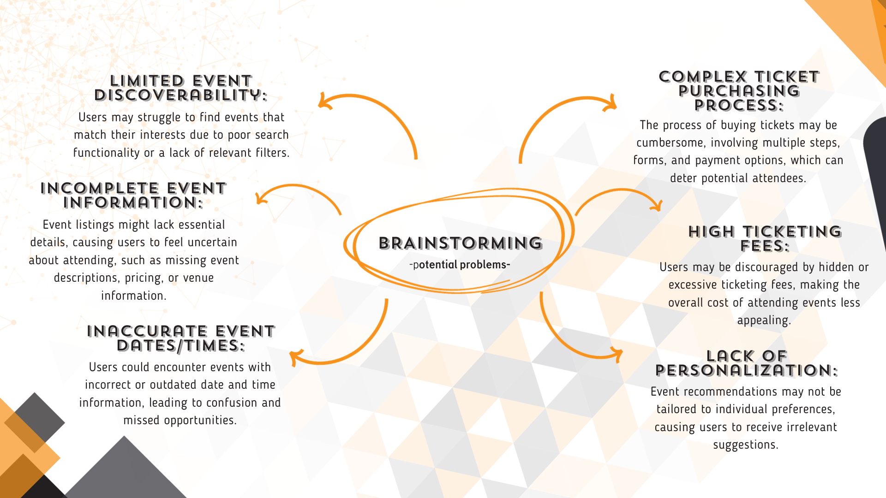

To kick off the project, I initiated a brainstorming session aimed at identifying potential challenges within the realm of event apps. My objective was to proactively pinpoint issues that might arise in this domain, helping me prepare for a more comprehensive understanding of the landscape:

Following my brainstorming session, I understood the necessity of delving deeper into the potential challenges I had identified. Consequently, I embarked on an extensive [library research](www.google.com) journey to explore potential solutions to these issues. To gain a more profound understanding of the problems associated with event-related apps, I created [empathy maps](www.google.com). These empathy maps provided valuable insights into the thoughts, feelings, and pain points of users during the event discovery and ticket purchasing process.

From the insights gained through the empathy maps, I concluded that users often encounter frustrations related to limited event discoverability, incomplete event information, and a complex ticket purchasing process. These issues can deter potential attendees and hinder their overall event experience. To address these challenges, my approach involves designing an event scheduler app that prioritizes user-friendly navigation, comprehensive event details, and a seamless ticket purchasing process. By focusing on these aspects, I aim to enhance event discoverability, improve user satisfaction, and ultimately create a more engaging and enjoyable event experience. To achieve these goals, I will explore the following key research questions:

1. What are the specific pain points and frustrations users encounter when trying to discover events through existing apps or platforms?
2. How do users typically gather information about events before making a decision to attend, and what challenges do they face in this process?
3. What are the common obstacles and complexities users encounter during the ticket purchasing process for events?

