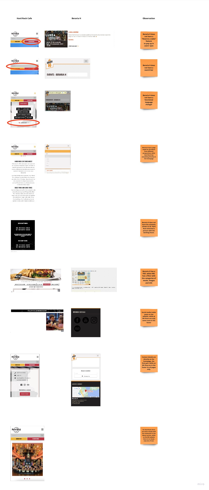
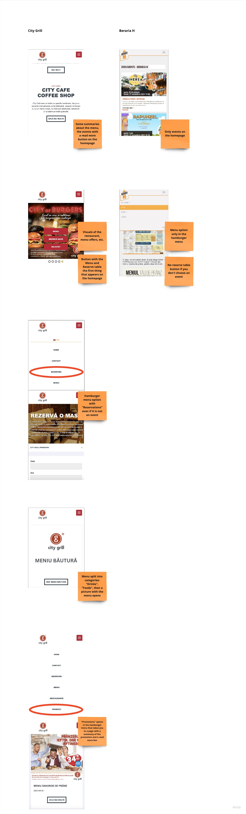
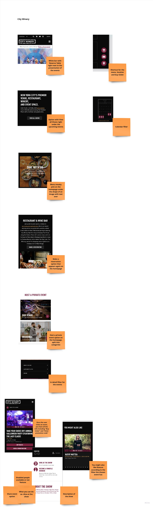

## Introduction

This competitor analysis aims to provide valuable insights into the strengths and weaknesses of existing event scheduler apps in the market. By examining these real competitors, I can identify opportunities and challenges that can inform the development of my Event Scheduler App for Beraria H.

## Competitor 1: Hard Rock Cafe

[Link to Miro for a clearer image](https://miro.com/app/board/uXjVMj2Vrlo=/?moveToWidget=3458764567637460109&cot=14)

## Competitor 2: City Grill

[Link to Miro for a clearer image](https://miro.com/app/board/uXjVMj2Vrlo=/?moveToWidget=3458764568145762573&cot=14)

## Competitor 3: City Winery

[Link to Miro for a clearer image](https://miro.com/app/board/uXjVMj2Vrlo=/?moveToWidget=3458764568148175350&cot=14)

## Other Competitors

[Check the document for more Beraria H competitors](https://git.fhict.nl/I476087/internship_berariah_s5_2023/-/wikis/uploads/a3019242800c2579242d30e0e4611f26/Denisa_Coteanu_BerariaH_CompetitorAnalysis.pdf)
