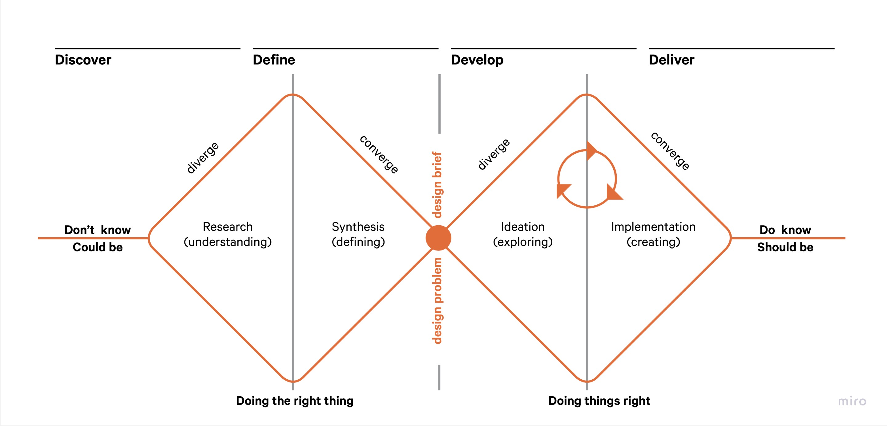
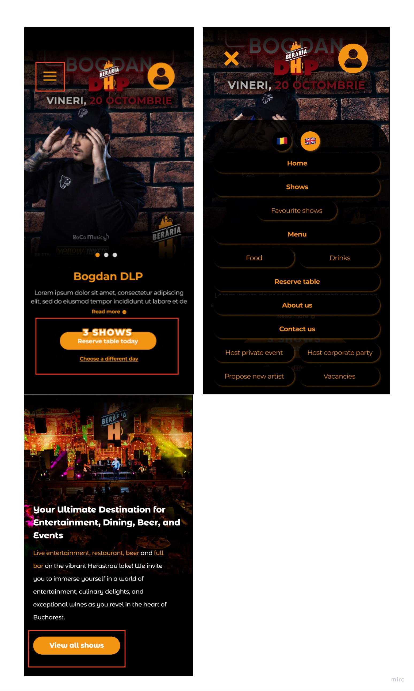
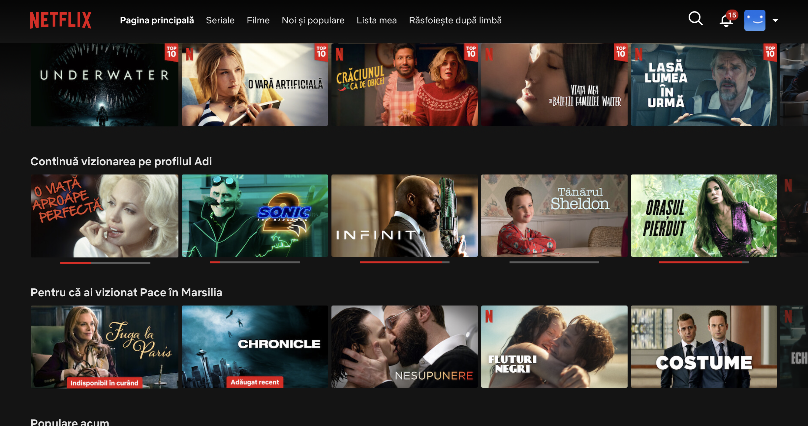
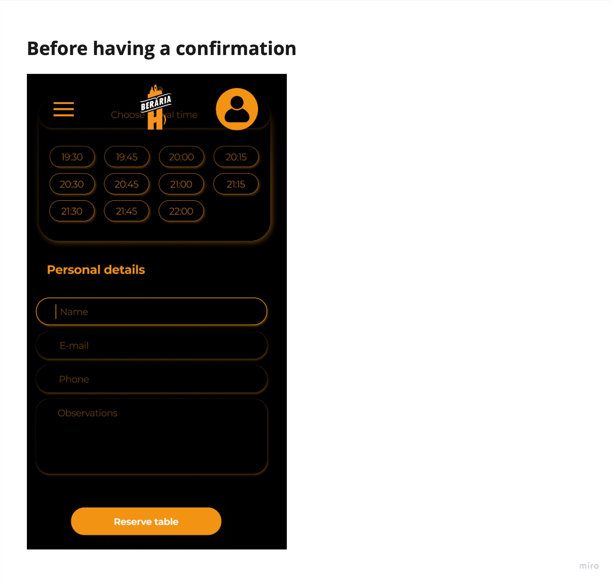
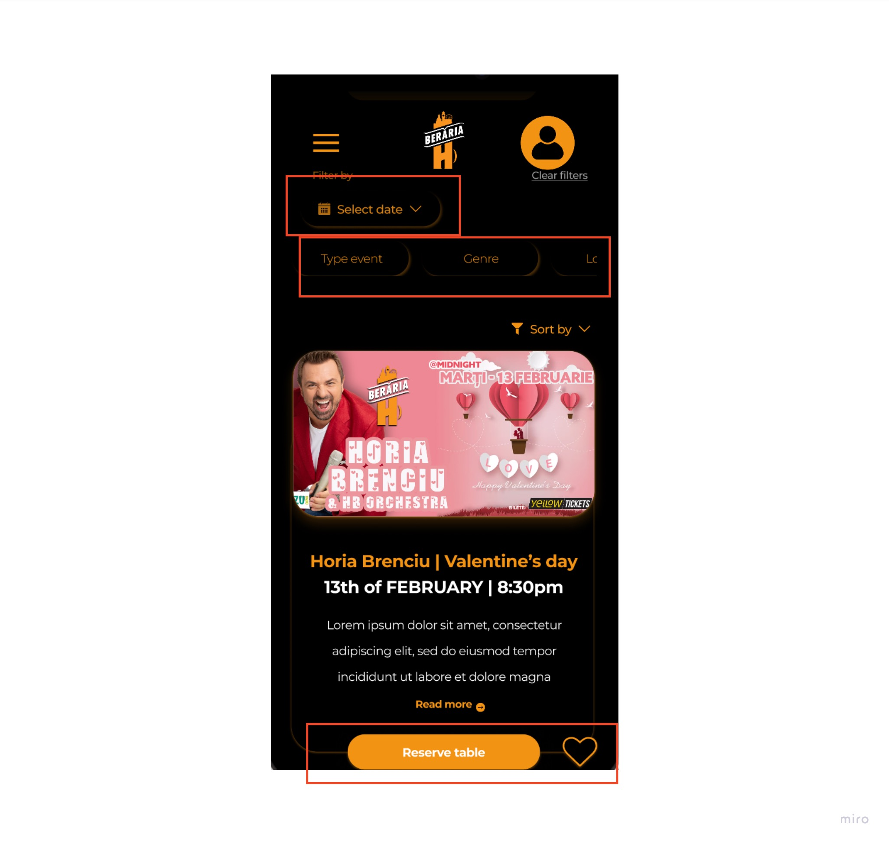

# Introduction

## Purpose
The aim of creating clear and concise design principles for The Beraria H web app is to ensure a harmonious user-centric and brand-aligned digital experience. Design principles serve as a framework providing a set of fundamental guidelines which influence every aspect of the user interface from visual aesthetics to functional interactions.

## Importance
Design principles play a pivotal role in shaping effectiveness of the Beraria H web app in the dynamic landscape of web design where user expectations and technological advances continuously evolve. These principles serve as a roadmap ensuring that every design decision aligns with the overarching goals of providing a seamless user experience and strengthening the unique identity of Beraria H. 

- [ ] - **Consistency:** Maintain a cohesive visual language and user experience across all sections of the web app for familiarity and ease of navigation. 
- [ ] - **Focus of the user:** Prioritize Beraria h's diverse user base needs preferences and behaviors ensuring that the web app addresses their expectations and provides value.
- [ ] - **Representation:** Infuse design elements that echo the distinctive personality of Beraria h creating a digital space that resonates with the brand's physical presence.
- [ ] - **Innovation:**  Support creative solutions and forward-thinking design approaches that elevate Beraria h’s web app above industry standards. 
- [ ] - **Adaptability:** Create a design foundation that can evolve with technological advances user feedback and the expansion of Beraria H products.

# General design principles
The development of designs that are both enjoyable and user-friendly is backed by UX principles. These guidelines serve as a compass, giving me essential direction as I select, create, and organise the components and tasks for my project. Essentially, design principles serve as the foundation of UX design, forming the user experience and influencing my endeavours' overall success.

## Meet the users' needs
Improving the user's experience with my product is the goal. Understanding what users are looking for is crucial, and user testing helps with this process. Although it might be tempting to create an interface that reflects my tastes, doing so might not be in line with the needs of the user, which would go against the main goal of creating an app that helps them.

I conducted multiple user tests and made multiple iterations, so I can say with confidence that my application provides a delightful user experience.

## Establish a distinct visual hierarchy
Users can navigate the interface with ease thanks to this guiding design principle. This seamless experience is made possible by a structured architecture, in which the main sections, like the hamburger menu, form the top level and are followed by lower layers. In a logical hierarchy, the homepage, for example, represents the second level. 

Setting priorities is very important, which means that the most important content should come first in the user journey. Later discussions will delve deeper into this idea.

The homepage, which has a carousel indicating the possibility of multiple events in a single day, is a key component of this structure. This homepage carousel is the main attraction, drawing users' attention to the main features. It is placed strategically. The concept that customers can book a table for a number of events taking place on the same day is conveyed clearly.

Building on this, a special area has been designed for users to explore all upcoming events at Beraria H. right below the carousel. This deliberate design decision guarantees an engaging introduction by starting the user journey with an events-focused approach, which fits in perfectly with the core of Beraria H's offerings. The goal is to grab users' attention right away and lead them logically through the wide variety of events that are offered.

## Less is more
My design philosophy prioritises simplicity and follows the rule of "less is more." This method avoids unnecessary finishing touches in favour of a clear, simple interface. The web application purposefully uses a dark theme to highlight bright photos, especially those that represent events. My goal is to create a visually compelling experience that prioritises essential elements while maintaining a sense of sophistication and ease of navigation, taking inspiration from Netflix's minimalist aesthetics.

 

## Using straightforward language
Simulating the aforementioned design principle, simplicity is essential when creating content that is focused on the user. Prioritise using simple language over technical jargon to communicate with users who are frequently busy, on the go, and managing multiple tasks. Choosing words that closely correspond with users' thoughts improves the design's usability and accessibility.

When choosing simple language for the design, keep these five things in mind:

- [ ] **Target Group and Design Purpose:** Consider the identity, background knowledge, needs, and goals of your communication's audience when crafting your message.
- [ ] **Structural Considerations:** Research common communication structures to make sure your content makes sense to readers and is arranged in an approachable manner.
- [ ] **Design Layout:** To improve the visual appeal and comprehension of the content, pay close attention to the typography, layout, and information graphics.
- [ ] **Expression Elements:** Think about the verb tenses, sentence structure, jargon, and word selections that will help your point be understood clearly.
- [ ] Evaluation and Usability Testing: To make sure your content is clear, concise, and user-friendly, have a new pair of eyes check it and carry out usability tests.

Essentially, the secret is to use language in your design that is clear and consistent in order to reduce ambiguity and improve the user experience overall. Following these guidelines helps you make sure that the ideas and requirements of your wide range of users are easily met by the content you produce.

## Ensuring clarity in users' actions
This fundamental idea focuses on eliminating uncertainty from user interactions in order to avoid any kind of misinterpretation. Consider a situation in which a user attempts to book a table for an upcoming event, but is unsure if the actions they took actually completed the reservation process. Because delivering a smooth and satisfying user experience is my top priority, my design philosophy works to address such situations.

See how the reservation process came to an end below, right before testing started. Explore the iterations used to improve this important step, which demonstrates my dedication to perfecting every detail for the most convenient and effective experience. By adhering to this principle, I aim to clarify any uncertainties users might have and guarantee that each action is not only validated but also completely final.

# Mobile design principles

Let's now turn our attention to mobile design and explore some design principles that are especially compatible with the special opportunities and challenges that come with mobile interfaces.

## Simplified Content Prioritisation: 
Mobile design must quickly capture users' attention because human attention spans are short, namely just a few seconds. Displaying content and functionality on smaller screens requires careful consideration due to their limited real estate. The principle of "Less is more" should be followed in order to create a clear hierarchy and present only the most important information to users without overloading them.

## Touchscreen Target Sizes: 
The significance of having suitable-sized touchscreen targets is highlighted by the fact that thumb usage is common on smartphones. I have to take into account the ergonomic difficulties that users encounter when navigating  our mobile interface, especially when using their thumbs.

Important industry standards, like Microsoft's proposal for 34 x 26 pixels and Apple's recommendation for a minimum size of 44 × 44 pixels, offer useful baselines. It's not enough to simply meet these size requirements, though; the distance between touch targets is just as important. Maintaining a sufficient distance between targets reduces the possibility that users will inadvertently press the incorrect button or initiate several actions at once.

## Increasing Interface Elements' Visibility
Making sure interface elements are clear is crucial in a world where mobile devices are everywhere. For best visibility, contrast between background and content must be carefully considered. We can look to the [Web Content Accessibility Guidelines](https://webaim.org/resources/contrastchecker/) established by the W3C for guidance on contrast ratios, especially with regard to text and images. By prioritising accessibility, my design not only satisfies aesthetic standards but also accommodates users in a variety of contexts and settings.

# Instagram-like functionality

## The community of Beraria H
A unique feature influenced by Instagram's charm was incorporated into the Beraria H web app to create a sense of community. With the help of this feature, users can view visually captivating pictures from the most recent performances of their favourite artists and participate in interactive conversations by leaving comments. Users are encouraged to share their ideas by using a "Share" button to easily expand the experience and an easy-to-use "Add to Favourites" option for quick personalisation.

Instagram stands out in today's digital landscape as a platform that is widely used and deeply integrated into users' daily online routines. It was intentional to include an Instagram-like feature in the Beraria H app, utilising its well-known design language. My goal is to provide an experience that seamlessly blends into my audience's digital lives by enhancing user comfort through the use of a design that echoes the familiarity of Instagram. This deliberate decision strengthens a sense of community and shared experiences within the Beraria H platform in addition to leveraging user familiarity.

## Colours

Instagram's design strategy has made effective use of colour, with a modern and vibrant colour scheme that adheres to a strict colour usage policy. The prevailing monochromatic style acts as a blank canvas on which each profile can subtly specify their own colour palette. Colour is used carefully to convey updates and interactions, giving each user a sense of personalisation and uniqueness thanks to this deliberate restraint.

Beraria H takes a similar tack, adopting an interface that is primarily black. When certain elements, like buttons, texts, and icons, demand the user's attention, they add a dynamic touch by using the solid colour orange. The app's purposeful use of colour minimalism makes sure that these emphasised elements catch the user's attention against the calm background.

The colour orange was chosen deliberately to strategically align with the values that the company aims to uphold. Orange is a colour that represents energy, vibrancy, and innovation. It also serves as a visual representation of the company's forward-thinking and dynamic nature. This vibrant and warm colour is purposefully used to stimulate creativity and excitement, which is consistent with my dedication to cutting-edge solutions and an engaging user experience.

## Consistency
People are naturally drawn to patterns and consistency, and this preference for regularity affects the design world. As a fundamental design principle that provides users with a navigational anchor, consistency stands out. Users get accustomed to a product's design language and know what to expect when they interact with it, thanks to consistent design.

Instagram's design philosophy is a clear illustration of this idea in action. Instagram posts follow a unique format that is carefully designed. This intentional consistency is a strategic decision rather than a restriction. It is essential to maintaining a consistent user experience because it offers a stable and dependable interface independent of the distinctive content that each user creates. That is why after testing and various opinions regarding the comments section, I took the decision of making it non-scrollable in order to respect Instagram's style.

