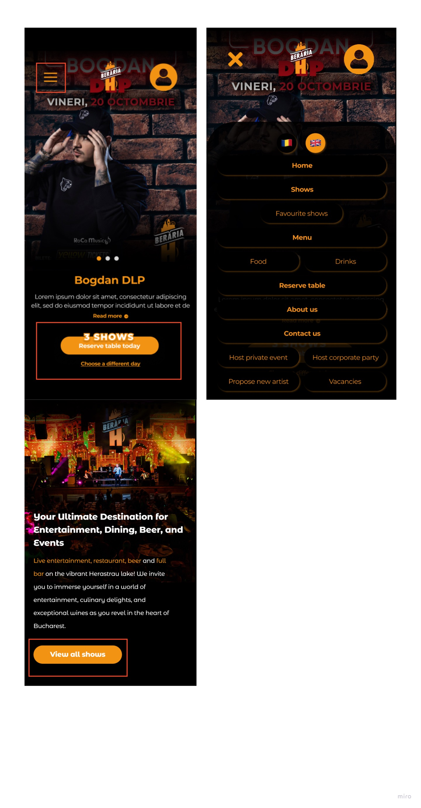

# Introduction

## Purpose
The aim of creating clear and concise design principles for The Beraria H web app is to ensure a harmonious user-centric and brand-aligned digital experience. Design principles serve as a framework providing a set of fundamental guidelines which influence every aspect of the user interface from visual aesthetics to functional interactions.

## Importance
Design principles play a pivotal role in shaping effectiveness of the Beraria H web app in the dynamic landscape of web design where user expectations and technological advances continuously evolve. These principles serve as a roadmap ensuring that every design decision aligns with the overarching goals of providing a seamless user experience and strengthening the unique identity of Beraria H. 

- [ ] - **Consistency:** Maintain a cohesive visual language and user experience across all sections of the web app for familiarity and ease of navigation. 
- [ ] - **Focus of the user:** Prioritize Beraria h's diverse user base needs preferences and behaviors ensuring that the web app addresses their expectations and provides value.
- [ ] - **Representation:** Infuse design elements that echo the distinctive personality of Beraria h creating a digital space that resonates with the brand's physical presence.
- [ ] - **Innovation:**  Support creative solutions and forward-thinking design approaches that elevate Beraria h’s web app above industry standards. 
- [ ] - **Adaptability:** Create a design foundation that can evolve with technological advances user feedback and the expansion of Beraria H products.

# General design principles
The development of designs that are both enjoyable and user-friendly is backed by UX principles. These guidelines serve as a compass, giving me essential direction as I select, create, and organise the components and tasks for my project. Essentially, design principles serve as the foundation of UX design, forming the user experience and influencing my endeavours' overall success.

## Meet the users' needs
Improving the user's experience with my product is the goal. Understanding what users are looking for is crucial, and user testing helps with this process. Although it might be tempting to create an interface that reflects my tastes, doing so might not be in line with the needs of the user, which would go against the main goal of creating an app that helps them.

I conducted multiple user tests and made multiple iterations, so I can say with confidence that my application provides a delightful user experience.

## Establish a distinct visual hierarchy
Users can navigate the interface with ease thanks to this guiding design principle. This seamless experience is made possible by a structured architecture, in which the main sections, like the hamburger menu, form the top level and are followed by lower layers. In a logical hierarchy, the homepage, for example, represents the second level. 

Setting priorities is very important, which means that the most important content should come first in the user journey. Later discussions will delve deeper into this idea.

The homepage, which has a carousel indicating the possibility of multiple events in a single day, is a key component of this structure. This homepage carousel is the main attraction, drawing users' attention to the main features. It is placed strategically. The concept that customers can book a table for a number of events taking place on the same day is conveyed clearly.

Building on this, a special area has been designed for users to explore all upcoming events at Beraria H. right below the carousel. This deliberate design decision guarantees an engaging introduction by starting the user journey with an events-focused approach, which fits in perfectly with the core of Beraria H's offerings. The goal is to grab users' attention right away and lead them logically through the wide variety of events that are offered.

