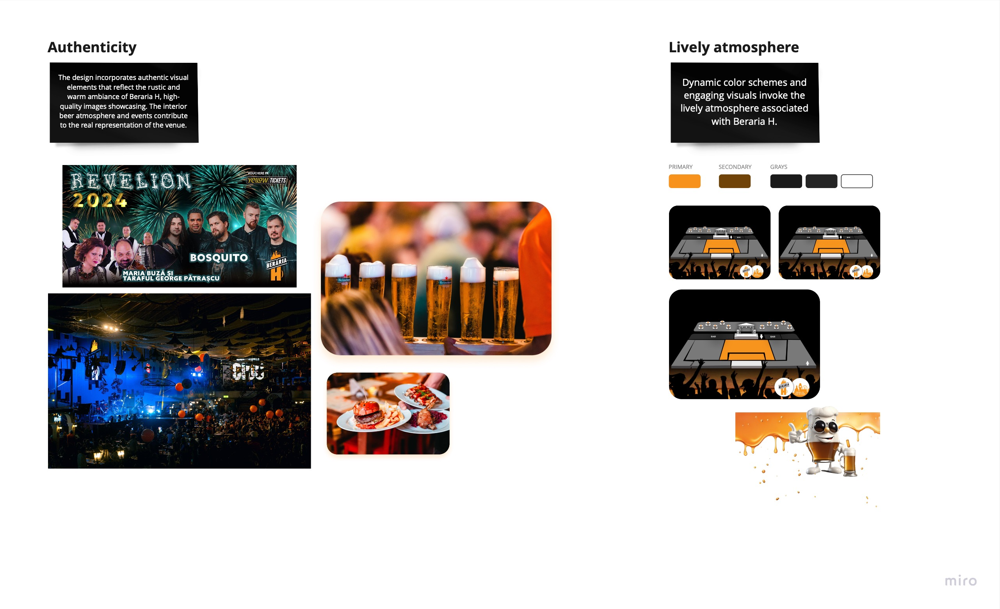

# Introduction

## Purpose
The aim of creating clear and concise design principles for The Beraria H web app is to ensure a harmonious user-centric and brand-aligned digital experience. Design principles serve as a framework providing a set of fundamental guidelines which influence every aspect of the user interface from visual aesthetics to functional interactions.

## Importance
Design principles play a pivotal role in shaping effectiveness of the Beraria H web app in the dynamic landscape of web design where user expectations and technological advances continuously evolve. These principles serve as a roadmap ensuring that every design decision aligns with the overarching goals of providing a seamless user experience and strengthening the unique identity of Beraria H. 

- [ ] - **Consistency:** Maintain a cohesive visual language and user experience across all sections of the web app for familiarity and ease of navigation. 
- [ ] - **Focus of the user:** Prioritize Beraria h's diverse user base needs preferences and behaviors ensuring that the web app addresses their expectations and provides value.
- [ ] - **Representation:** Infuse design elements that echo the distinctive personality of Beraria h creating a digital space that resonates with the brand's physical presence.
- [ ] - **Innovation:**  Support creative solutions and forward-thinking design approaches that elevate Beraria h’s web app above industry standards. 
- [ ] - **Adaptability:** Create a design foundation that can evolve with technological advances user feedback and the expansion of Beraria H products.

# Brand alignment

## Overview
The web app's design is delicately aligned with the brand identity of Beraria H. The web app serves as a digital extension of the unique personality of Beraria H, embodying its vibrant atmosphere and commitment to providing an exceptional customer experience.

## Key brand attributes

- [ ] **Authenticity: **The design incorporates authentic visual elements that reflect the rustic and warm ambiance of Beraria H, high-quality images showcasing. The interior beer atmosphere and events contribute to the real representation of the venue.
- [ ] **Lively atmosphere: **Dynamic color schemes and engaging visuals invoke the lively atmosphere associated with Beraria H.

[Check Miro for a clearer image](https://miro.com/app/board/uXjVMj2Vrlo=/?moveToWidget=3458764572823466574&cot=14)

