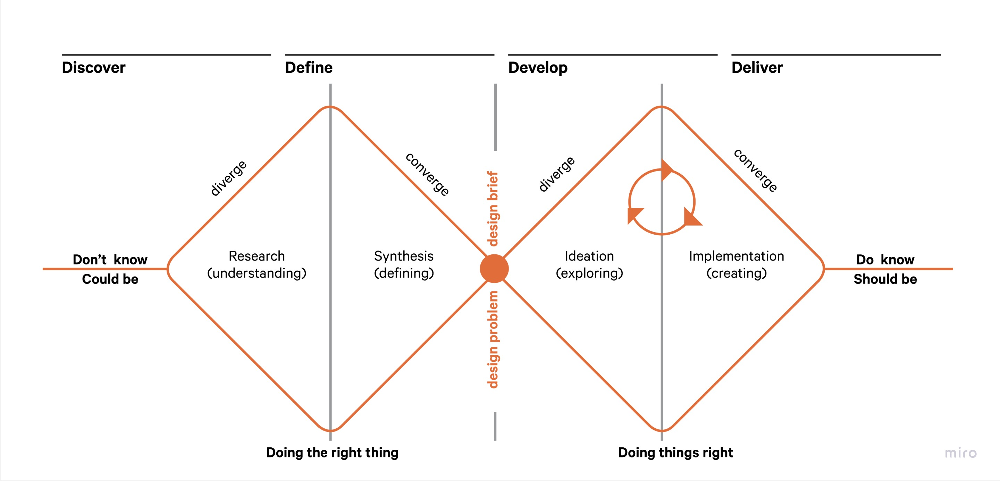

## Introduction
In alignment with the Beraria H project, I have chosen to adopt the Double Diamond methodology to guide my solo endeavors. This method encompasses four distinct phases, each mapped to four dedicated sprints.

- **Discover Phase:** During the initial phase, which is the discover phase, I embrace divergence. Here, I engage in extensive research using various approaches to gain a comprehensive understanding of the challenges faced by individuals.
- **Define Phase:** In the subsequent define phase, I synthesize the insights obtained from my research. Based on these findings, I will brainstorm diverse ideas and potential solutions tailored to address the specific needs and challenges of disabled individuals.
- **Development Phase:** Moving on to the development phase, I take the refined ideas and transform them into tangible prototypes. These prototypes will undergo rigorous user testing to evaluate their functionality and alignment with the project's objectives.
- **Deliver Phase:** Lastly, in the deliver phase, I will provide a fully functional prototype that reflects the culmination of the project's efforts, adhering to the methodology's structured approach even when working independently.

