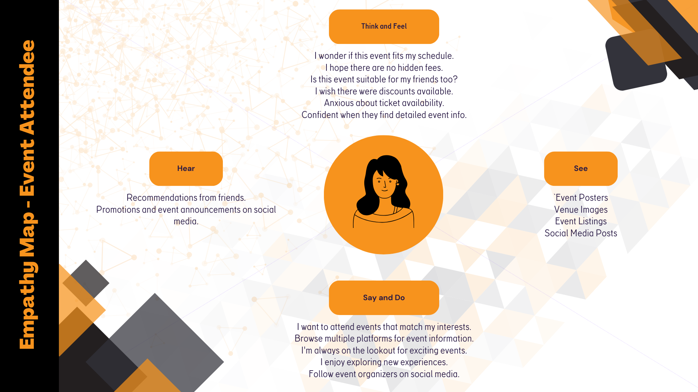
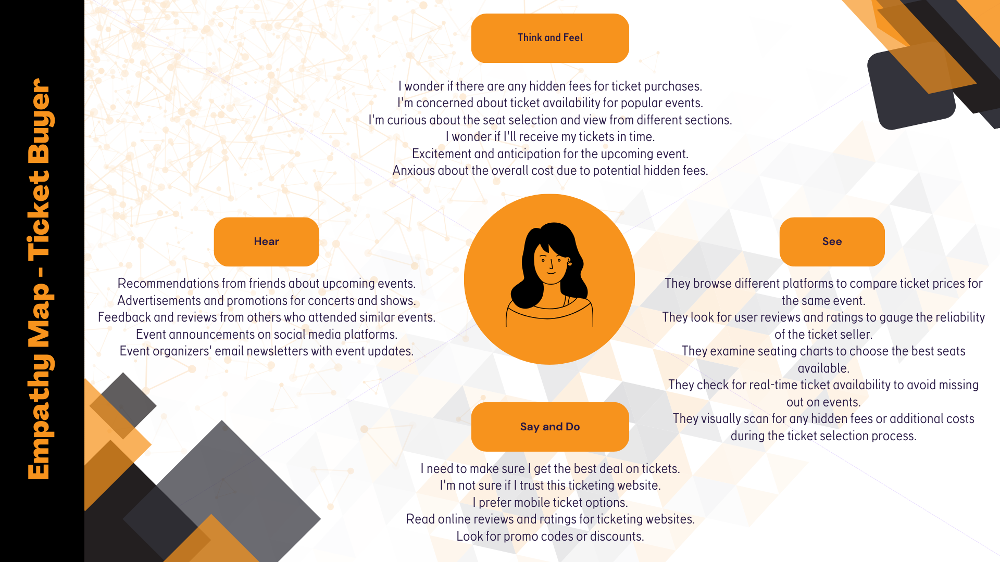

Following my brainstorming session, it became evident that a deeper investigation into these potential challenges was necessary. I recognized the importance of understanding the thoughts, actions, words, hearing, and emotions of individuals when they consider purchasing tickets for new events. As a result, I took the initiative to develop two empathy maps, one focused on the ticketing process, while the other delved into the experience of attending the event itself. This step was crucial in gaining valuable insights into the user's perspective and enhancing the design process.

### Empathy map for event attendee

### Empathy map for ticket buyer

### Insights

The combined insights from both empathy maps focus on essential aspects of people's behavior and preferences when attending an event. prioritize convenience, entertainment value, and the relevance of events in their decision-making process. They actively seek event information online and prefer mobile ticketing options for the sake of convenience. Furthermore, attendees often express excitement and anticipation about attending events, and their decisions can be influenced by recommendations from friends and event announcements. are primarily concerned with pricing, ticket availability, and the credibility of sellers. They tend to compare ticket prices, actively seek discounts, and verify the legitimacy of sellers before making a purchase. Common phrases in their thoughts and actions include "affordable tickets," "secure purchase," and "best deal." It's important to note that buyers may also feel hesitant, harbor trust concerns, but experience a sense of relief post-purchase.

### What am I going to do with these insights?

In conclusion, the insights gathered from the combined empathy maps provide a rich understanding of people's behaviour when purchasing an event. These insights serve as a compass, guiding the direction of my research and design efforts throughout this project. 

Armed with this knowledge, I am well-equipped to address the specific pain points, needs, and expectations of these user groups. As a result, the focus will be on enhancing their overall experience, ensuring seamless event discovery, and optimizing the event itself. This may involve personalized event recommendations, mobile ticketing solutions, and engaging event announcements. Moreover, the emphasis will be also on building trust, simplifying the ticket purchasing process. Strategies such as transparent pricing, secure payment options, and thorough seller verification will be explored. 

These insights not only inform the next stages of this project but also underscore the user-centric approach I aim to uphold, ultimately ensuring that the end product caters to the real needs and desires of its users.

