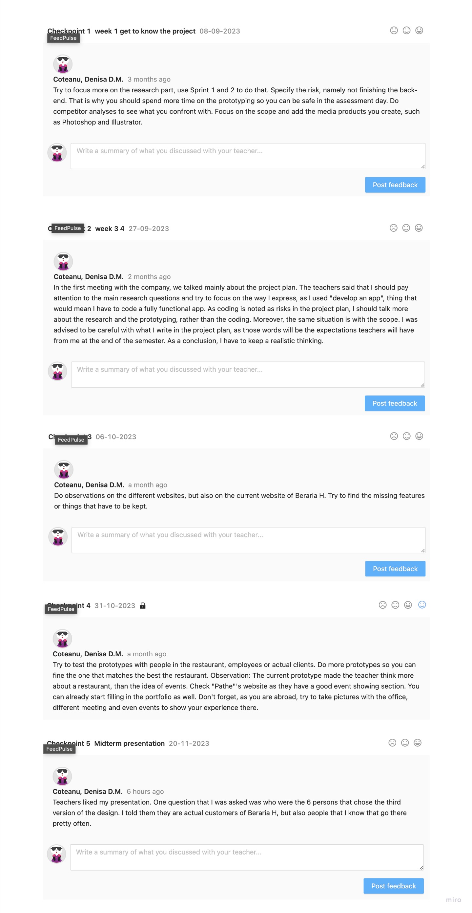

## Introduction
Over the course of the semester, I documented a Feedpulse. Within this segment of my portfolio, I offer a comprehensive overview of my Feedpulse activities.

## Process
Like clockwork, after engaging in feedback conversations with Penny, I instituted a Feedpulse checkpoint. Within this checkpoint, I not only delved into the specifics of my weekly accomplishments but also critically assessed the procedural aspects. Furthermore, I took the opportunity to articulate my plans for the upcoming week. This systematic approach not only granted me insights into my weekly progress but also provided a structured understanding of my work methodology.

## Feedpulse Canvas
