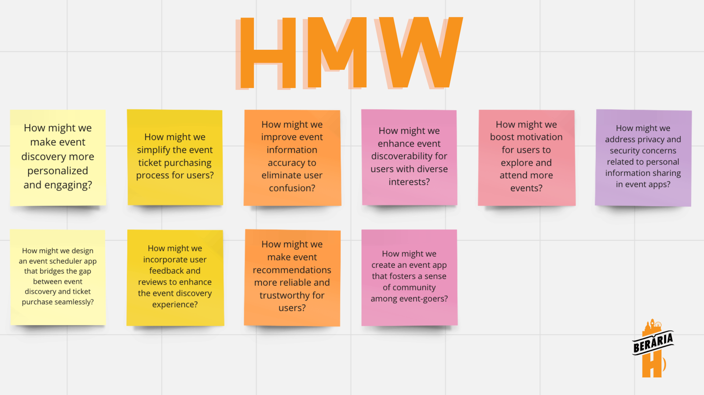

### Explanation

In light of the insights acquired through my comprehensive research efforts, I have meticulously crafted a series of 'How Might We' (HMW) questions. These questions serve the fundamental purpose of elucidating the nuanced aspects of the challenge at hand, facilitating a deeper comprehension of the targeted problem that my innovation endeavors to address.

### HMW questions

### How were these questions employed in my research process? 

The 'How might we' questions served as a foundational element during my [brainstorming session](www.google.com). Their purpose was to facilitate the identification of key challenges and opportunities within the research scope. By leveraging these questions, I effectively delineated the problem space and initiated the exploration of innovative solutions. This strategic application of 'How might we' questions aligns with the research methodology undertaken, thereby aiding in the generation of actionable insights.