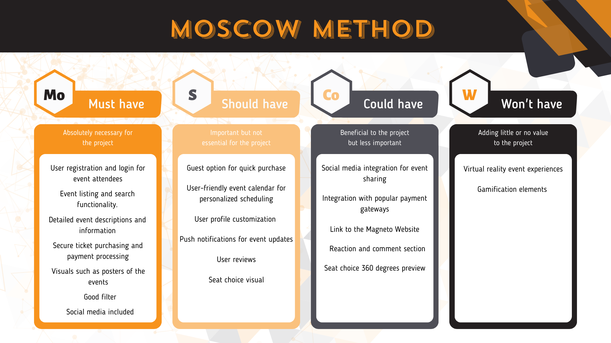

### Introduction

\
The MoSCoW method is a prioritization technique that I have incorporated into my project to systematically define and manage feature requirements. By categorizing features into four distinct groups — Must-haves, Should-haves, Could-haves, and Won't-haves — I aim to establish a clear hierarchy of importance for each aspect of the event scheduler app. This method is essential for guiding the project's development process, as it helps me make informed decisions about what features are critical for the initial release and what can be considered for future iterations. By using the MoSCoW method, I ensure that the app's core functionality aligns with the primary objectives of enhancing event discoverability, improving user satisfaction, and streamlining the ticket purchasing process. This approach allows me to focus my efforts on delivering essential features that address users' most significant pain points while leaving room for potential enhancements in subsequent development phases.

### Moscow Method

## Update

It was not practical to directly implement the "Secure payment must have" feature on the main website because Beraria H chose to continue working with YellowTickets, an outside website for ticket purchases. Instead, my attention turned to improving user comprehension of Beraria H's purchasing procedures and enabling easy access to the ticketing website.  I have developed a simplified method to lead users to their destination with ease. Please see the following section for a more thorough explanation: [YellowTickets partner.](url)