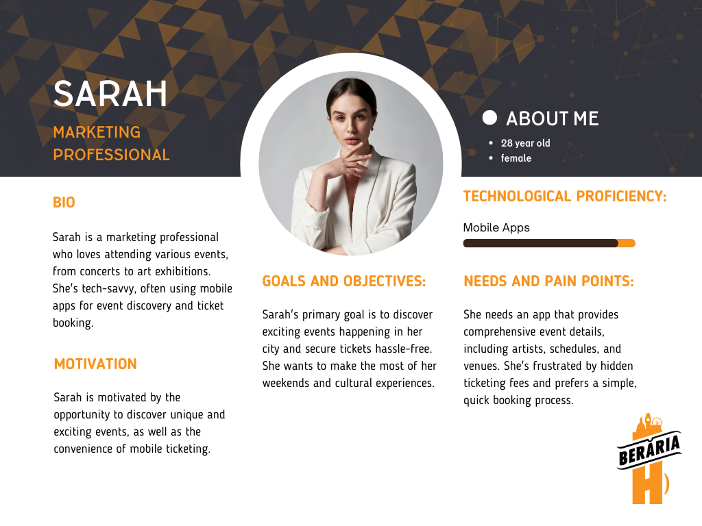
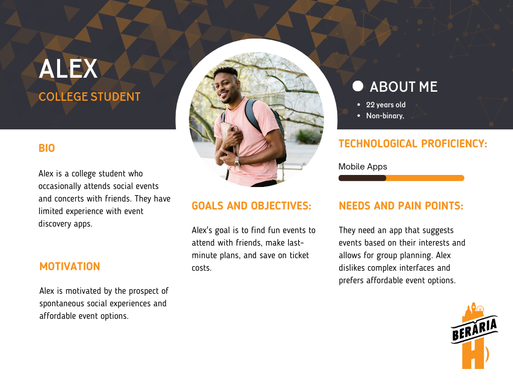
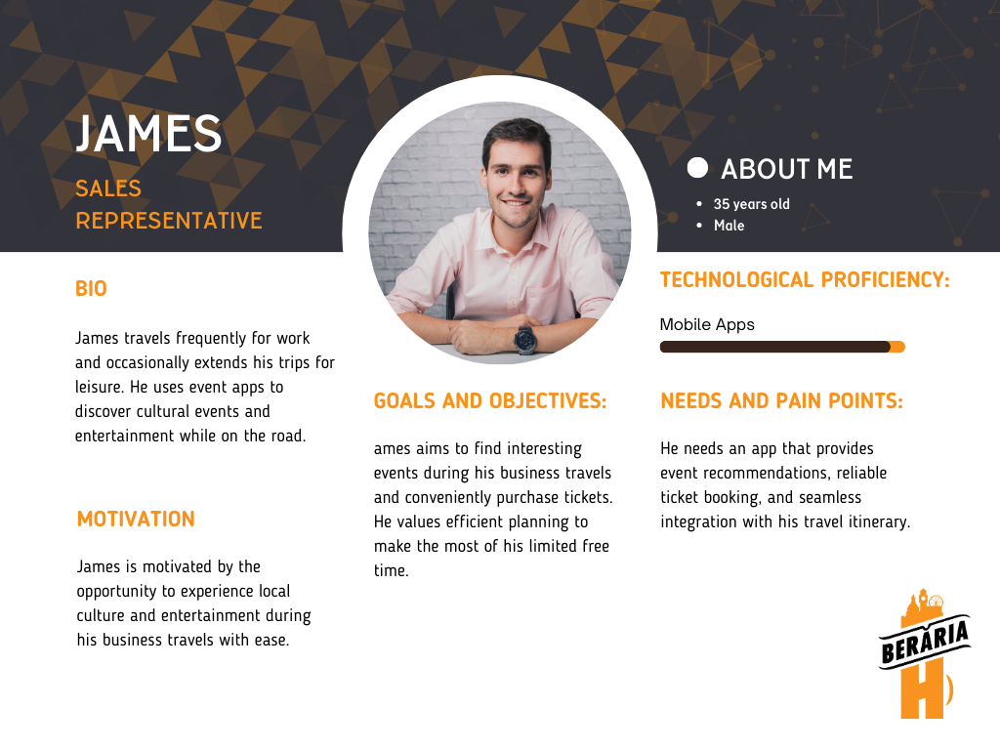

### Explanation 

Following the comprehensive research conducted during the Discover phase, the project transitioned into the Define phase, marking a critical juncture in the development process. During this phase, the focus shifted towards conceptualizing potential IT products. It is imperative to have a clear understanding of the intended users of the product, and to achieve this, the creation of personas became integral.

Leveraging the valuable insights gleaned from the insightful interviews conducted earlier, these personas were meticulously crafted. The process involved not only identifying users' overarching goals and objectives but also delving into their specific needs and pain points. This approach aimed to transform the collected data from mere raw statistics into relatable individuals, each representing a distinct perspective for whom the IT solution is being tailored.

Given the diverse nature of event attendees, with a broad demographic spanning ages, a strategic decision was made. While the age group of 35-55 remained relevant, the 18-34 demographic emerged as the largest cohort among the research participants. Acknowledging that event attendance transcends age boundaries, a conscious choice was made not to restrict the product to a single demographic. Instead, the vision is to develop an inclusive application accessible to individuals of varied age groups who share a common interest in attending events. This strategic approach underscores the project's commitment to catering to the diverse needs of event enthusiasts based on the comprehensive research findings.

### These are the personas I have made

### What have I learned?

Over the course of my academic journey, I have dedicated significant effort to honing my research skills, and this semester represents a pivotal moment in my commitment to elevating these capabilities. The profound focus on research has provided me with invaluable insights. In particular, I have acquired the skill of crafting intricate and authentic human profiles through meticulous research. Reflecting on past experiences, I acknowledge and have learned from previous missteps in this regard. The importance of personas in guiding subsequent stages of concept development has become abundantly clear. Having a well-defined persona serves as an invaluable anchor during the creative process, instilling a tangible and relatable presence into the ideation and design phases. Moreover, I have meticulously crafted a versatile persona template, tailored to my unique needs, ensuring a streamlined approach for any future persona development endeavors. This enriched understanding and practical resource are poised to significantly enhance my research-driven initiatives and innovative projects moving forward.