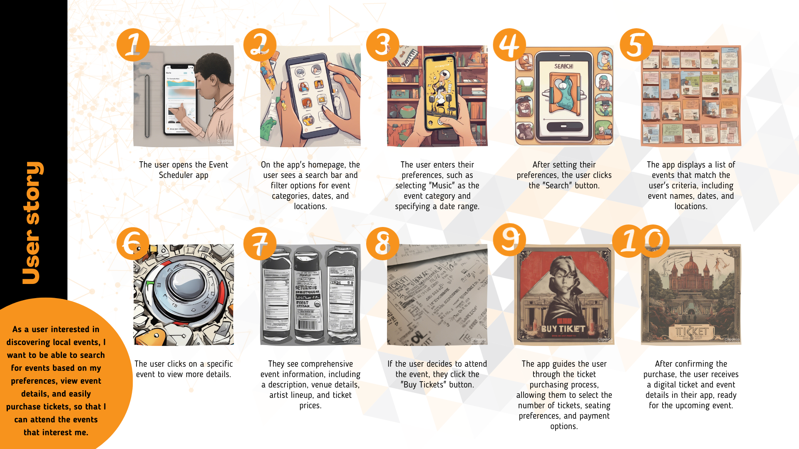

In my pursuit of understanding user preferences, I crafted a user story, seeking to uncover their specific desires. Subsequently, I applied the [MoSCoW method](https://git.fhict.nl/I476087/internship_berariah_s5_2023/-/wikis/Moscow-method) to establish priorities among these requirements. This method allowed me to distinguish the features deemed essential (the "MUSTs") from those that are more flexible (the "COULDs"). The intention behind this classification is to optimize my workload distribution effectively. The ultimate aim is to construct a series of concise "definitions of done" derived from this user story. This approach serves the purpose of setting tangible objectives, enhancing the precision of my planning and organizational efforts.

