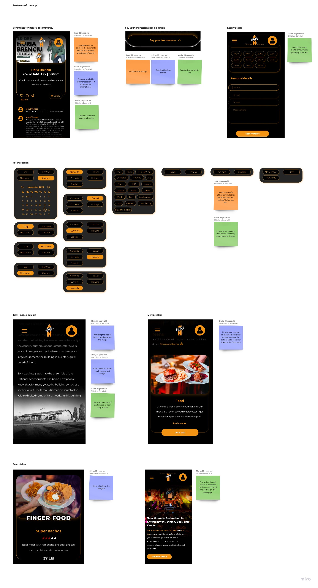

## Introduction

As I delved into the design phase, I recognized the critical need to validate and refine each aspect of the project to ensure it resonated with Beraria H's unique identity. This imperative led me to conduct user tests, a pivotal step in crafting a user-centric and brand-aligned design.

# Testing 1: Choose design path

The initiation of the design process prompted a crucial decision-making phase where I sought to identify the most effective approach for Beraria H's digital identity. To accomplish this, I committed to developing [three distinct prototypes](url) for the homepage. The primary goal was to ascertain which design would best encapsulate Beraria H's identity.

## Gathering clients' feedback

After presenting the initial designs to Beraria H's clients, the invaluable feedback received played a pivotal role in shaping the next steps of the UI development.

**Testing task:**
Check all 3 designs and tell me why you like one better than the other. Be specific.
- [Figma prototype version 1](https://www.figma.com/proto/YvT4znDvd3RzES22pEyV45/BerariaH-Scheduler-App?type=design&node-id=107-108&t=nBg11MD91s2tS3Ht-1&scaling=scale-down&page-id=0%3A1&starting-point-node-id=236%3A399&show-proto-sidebar=1&mode=design)
- [Figma prototype version 2](https://www.figma.com/proto/YvT4znDvd3RzES22pEyV45/BerariaH-Scheduler-App?type=design&node-id=280-330&t=w5ThS9sQP2rXKxMQ-1&scaling=scale-down&page-id=0%3A1&starting-point-node-id=236%3A399&show-proto-sidebar=1&mode=design)
- [Figma prototype version 3](https://www.figma.com/proto/YvT4znDvd3RzES22pEyV45/BerariaH-Scheduler-App?type=design&node-id=334-280&t=yCHfjJ57YzDcEE90-1&scaling=scale-down&page-id=0%3A1&starting-point-node-id=587%3A327&show-proto-sidebar=1&mode=design)

[Link to Miro for a clearer image](https://miro.com/app/board/uXjVMj2Vrlo=/?moveToWidget=3458764572725670558&cot=14)

## Insights

Upon conducting user testing, the third prototype emerged as a front-runner, capturing valuable insights and affirming its potential alignment with Beraria H's identity. However, there are some parts that I should stick to:

#### Cartoon characters

The cartoon characters, a distinctive feature from the initial prototype, resonated positively with users. However, adjustments are going to be made to strike a balance, ensuring a visually appealing representation without overwhelming the design.

#### Scroll directions

User feedback emphasized the importance of maintaining clear and intuitive scroll directions. Addressing this, I focused on refining the navigation experience, ensuring users could seamlessly explore the homepage without confusion.

#### Colour palette

The color palette from the third prototype stood out as the most fitting for an event app. It not only aligned with Beraria H's brand identity but also contributed to creating a vibrant and dynamic atmosphere conducive to event exploration.

#### Automatic slider

Responding to user preferences and to enhance user engagement, I opted for an automatic slider rather than a manual one. This decision was guided by the desire to streamline the user experience, allowing users to effortlessly discover a variety of events without manual interaction.

#### Portrait posters

The user testing phase highlighted a preference for portrait posters over landscape ones. In line with this insight, the third prototype maintained this orientation, ensuring a visually cohesive and preferred display of event content.

## Conclusion

Continue on working on the third version of the prototype and stick to the insights gathered after the user testings. 

# Testing 2: Check the UX/UI

