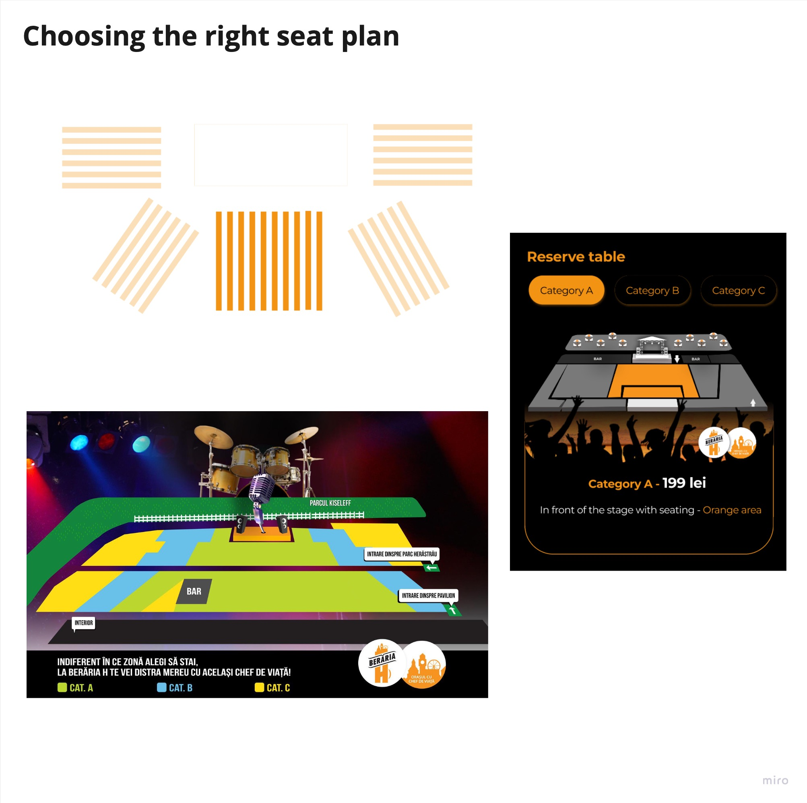

## Introduction

As I delved into the design phase, I recognized the critical need to validate and refine each aspect of the project to ensure it resonated with Beraria H's unique identity. This imperative led me to conduct user tests, a pivotal step in crafting a user-centric and brand-aligned design.

# Testing 1: Choose design path

The initiation of the design process prompted a crucial decision-making phase where I sought to identify the most effective approach for Beraria H's digital identity. To accomplish this, I committed to developing [three distinct prototypes](url) for the homepage. The primary goal was to ascertain which design would best encapsulate Beraria H's identity.

## Gathering clients' feedback

After presenting the initial designs to Beraria H's clients, the invaluable feedback received played a pivotal role in shaping the next steps of the UI development.

**Testing task:**
Check all 3 designs and tell me why you like one better than the other. Be specific.
- [Figma prototype version 1](https://www.figma.com/proto/YvT4znDvd3RzES22pEyV45/BerariaH-Scheduler-App?type=design&node-id=107-108&t=nBg11MD91s2tS3Ht-1&scaling=scale-down&page-id=0%3A1&starting-point-node-id=236%3A399&show-proto-sidebar=1&mode=design)
- [Figma prototype version 2](https://www.figma.com/proto/YvT4znDvd3RzES22pEyV45/BerariaH-Scheduler-App?type=design&node-id=280-330&t=w5ThS9sQP2rXKxMQ-1&scaling=scale-down&page-id=0%3A1&starting-point-node-id=236%3A399&show-proto-sidebar=1&mode=design)
- [Figma prototype version 3](https://www.figma.com/proto/YvT4znDvd3RzES22pEyV45/BerariaH-Scheduler-App?type=design&node-id=334-280&t=yCHfjJ57YzDcEE90-1&scaling=scale-down&page-id=0%3A1&starting-point-node-id=587%3A327&show-proto-sidebar=1&mode=design)

[Link to Miro for a clearer image](https://miro.com/app/board/uXjVMj2Vrlo=/?moveToWidget=3458764572725670558&cot=14)

## Insights

Upon conducting user testing, the third prototype emerged as a front-runner, capturing valuable insights and affirming its potential alignment with Beraria H's identity. However, there are some parts that I should stick to:

#### Cartoon characters

The cartoon characters, a distinctive feature from the initial prototype, resonated positively with users. However, adjustments are going to be made to strike a balance, ensuring a visually appealing representation without overwhelming the design.

#### Scroll directions

User feedback emphasized the importance of maintaining clear and intuitive scroll directions. Addressing this, I focused on refining the navigation experience, ensuring users could seamlessly explore the homepage without confusion.

#### Colour palette

The color palette from the third prototype stood out as the most fitting for an event app. It not only aligned with Beraria H's brand identity but also contributed to creating a vibrant and dynamic atmosphere conducive to event exploration.

#### Automatic slider

Responding to user preferences and to enhance user engagement, I opted for an automatic slider rather than a manual one. This decision was guided by the desire to streamline the user experience, allowing users to effortlessly discover a variety of events without manual interaction.

#### Portrait posters

The user testing phase highlighted a preference for portrait posters over landscape ones. In line with this insight, the third prototype maintained this orientation, ensuring a visually cohesive and preferred display of event content.

## Conclusion

Continue on working on the third version of the prototype and stick to the insights gathered after the user testings. 

# Testing 2: Check the UX/UI

After having the insights from my previous testing, I could continue with the prototype and fully develop it in Figma. After adding all the features I have planned, I underwent testings again with new clients Beraria H, but also old ones, using two different methods. 

### Users testings
- [Testing video 1: Joao, 22 years old, new client Beraria H](https://gemoo.com/tools/upload-video/share/592510051024932864?codeId=Ml2AadqJ0gbwY&card=592510046826434560)
- [Testing video 2: Silviu, 35 years old, new client Beraria H](https://gemoo.com/tools/upload-video/share/592512172197724160?codeId=Pa1LkGnqbzY9b&card=592512168435437568&origin=videolinkgenerator)
- [Testing video 3: Mara, 25 years old, old client Beraria H](https://gemoo.com/tools/upload-video/share/592512535441219584?codeId=M0G41zEVawbxa&card=592512531666354176&origin=videolinkgenerator)

[Link to Miro for a clearer image](https://miro.com/app/board/uXjVMj2Vrlo=/?moveToWidget=3458764572730671092&cot=14)

## First impression testing method

Incorporating the First Impression Testing Method played a pivotal role in obtaining authentic reactions from participants as they explored the Beraria H app's homepage for the first time. The primary objective was to ensure that users formed favorable impressions upon landing on the app, aligning with the overall design goals. This method served as a crucial step for the effectiveness of the user interface in capturing attention and conveying the desired brand image.

### Questions and tasks:

- [ ] Without clicking, scroll up and down the page. At first glance, what is the purpose of this website? 
- [ ] What, if anything, draws your attention or stands out to you? Be specific.
- [ ] What do you think you can do on this website?
- [ ] Is there enough information to understand the purpose of this website? If not, what should be included to make it clear? Be specific.
- [ ] Take some time to scroll up and down the page but don’t click off of the page. What are your thoughts on the design (images, colors, styling) and layout of this page?
- [ ] What are three (3) words that you would use to describe this website?
- [ ] What is the first action you would take on this website? Please explain why you want to take that action & what you expect to see after taking that action. Once you’ve verbally responded, please take that action.

## Website navigation method

Users should be able to seamlessly find what they’re looking for on the web app. I used this method in order to diagnose findability issues. If people can’t find what they’re looking for, they won’t be able to achieve their goal. It will help make the product as intuitive as possible. When the app's navigation is intuitive, there will be more conversions, lower bounce rate and enhanced customer satisfaction. Beraria H’ll also be able to save on customer support since customers will able to self serve. 

### Questions and tasks:

- [ ] Find the page with the events. You want to see only the events from this week. What do you do? 
- [ ] I would like to show you more filters that are not on the prototype at the moment and I need your opinion about how helpful they are, if they are enough for you to help you achieve an easier process of browsing or not. Would you add anything else?
- [ ] How would you improve the process of filtering?
- [ ] Choose the event “Horia Brenciu”, try to reserve a table with category C, for 3 people, at 20:30. Speak your thoughts out loud as you look. When you’ve found it proceed to the next task.
- [ ] How would you improve the process of reserving a table to an event?
- [ ] Find images from the event and then try to see what the community of Beraria H is saying then leave your own comment. Speak your thoughts out loud as you look. When you’ve found it proceed to the next task.
- [ ] You want to host a private event. Try to set up everything from the app. Speak your thoughts out loud as you look. When you’ve found it proceed to the next task.
- [ ] You want to find out more about the story of Beraria H. Try it.
- [ ] Do you think it is too much information that is overwhelming to you or is it structured in a such good way that it makes everything go smoothly?
- [ ] How would you improve this page?
- [ ] You would like to check the menu of the restaurant. You want to eat there tomorrow so try to find the page. 
- [ ] Check how the Finger food meals are structured. For example, the title of the food “super nachos”, description, price. What else would you like to see there as information about the food, if it is the case?
- [ ] You wanna find Beraria H’s social media. Where do you look? 
- [ ] You already have an account and want to login. Try to reserve a table again. Do you think the process is easier?

## Insights

#### Scrollable comments section

- [ ] **Observation:** Tests indicated that a scrollable comments section is preferable for the mobile app.
- [ ] **Consequences:** Scrollable comments overlaying with the page's scroll.
- [ ] **Possible solution:** Implement a solution to address the overlay issue while maintaining the scrollable feature for improved mobile usability.
- [ ] **Problem solved:** I chose to make the comments section non-scrollable in order to stick to the Instagram style, a design that people are already used to.

#### Visibility of "Say Your Impression" Option:

- [ ] **Observation:** The "Say Your Impression" option was not visible enough.
- [ ] **Possible solution:** Transform it into a floating feature in the bottom right corner to enhance visibility and accessibility.
- [ ] **Problem solved:** I created a right bottom corner floating option that has a "Comments" icon. To make it more visible, I added a red number bullet, that displays the number of comments the user is going to find in that section.

#### Total Reservation Cost Calculation:

- [ ] **Recommendation:** Introduce a feature that calculates and displays the total cost for reserving a table, enhancing transparency for users.
- [ ] **Problem solved:** I did not implement such option, as from Beraria H's website users can only reserve a table. However, I added a button "Buy ticket" that people can access in order to purchase the tickets. 

#### Filter Option for Availability:

- [ ] **Suggestion:** Consider adding a filter option for "Availability," such as "Only a Few Left," to streamline user choices.
- [ ] **Problem solved:** Filter with "Only a few left" added. 

#### Overlayed Text with Images:

- [ ] **Check:** Evaluate the overlayed text with images to ensure clarity and readability.
- [ ] **Problem solved:** Text is not overlaying with images anymore.

#### Clickable Food and Drinks Container:

- [ ] **Improvements:** Make the entire food and drinks container on the Menu page clickable for a more intuitive user experience.

#### Additional Information for Foods and Drinks:

- [ ] **Observation:** Users expressed a need for more information about foods and drinks.
- [ ] **Possible Solution:** Explore the current QR code on the Beraria H menu, where nutritional information is stated
- [ ] **Problem solved:** I added a button right where the category of food is displayed, that people can access to see more nutritional information about that category.

## Conclusion

The insights gathered from the testings have provided valuable feedback to enhance the user experience of the Beraria H app. The implementation of these insights into the final prototype aims to address user concerns, improve overall usability, and ensure that the app not only meets but exceeds user expectations.

# Testing 3: testing features through feedback
As it was pretty hard to come up with solutions to all the problems there are on the current website of Beraria H, I asked for feedback from potential users for multiple features I have worked on. 

## Feature 1: Seat categories
As displaying a 3D seat plan was not a realistic feature, as I don't have the resources, I had to think about a different way of showing people the options through visuals. 

**Phase 1:** The obvious way was to create a 2D plan. But how should it look? I first thought about designing some tables in rectangle shapes and adding circles for each seat, but after talking to the marketing team and telling me that people can't choose a specific seat, but only a category, I realised that this option was not good. 

**Phase 2:** Phase 2 was to actually take the actual image with the seat plan from their website and add it as a general picture right when the user chooses the category. In the end, I thought that looks too bad and has nothing to do with the app I am designing, so I tried to design it myself in Photoshop.

**Phase3:** The phase 3 was a succes in the end, as finally I could find the right design for the app. I coloured each category with the specific orange colour of the brand, and split the seats into categories through buttons: "Category A", "Category B", "Category C". I also personalised the terrace with little umbrellas and little chairs and emphasised the stage with a white colour and the right illustration.

## Feature 2
As vertical scrolling was too confusing for users taking into account that the page is already scrollable, I changed the "Facts" and "Press" sections with a "Read more" button that open popups. In this way, the scrolls won't overlay.

