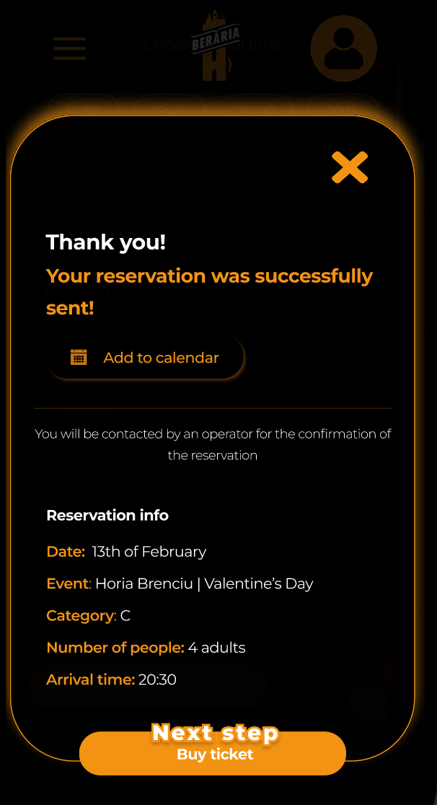

## Introduction
The addition of a ticket purchasing feature within the app represented an important step in my project plan. The nuances of this significant development are explored in more detail in this section.

## Reserve table feature
Starting with the current website of Beraria H, there is a "Reserve table" feature, that if pressed, it will send a notification to the company that the user wants to reserve a table for a specific event. Then, the user receives a notice that they will be contacted later on for the reservation confirmation.The user receives an email with the confirmation or with the further notice: "You cannot reserve for this event. You have to purchase directly the tickets from YellowTicket's website".

## Yellow Tickets
This is a website meant for helping companies sell tickets to their users. They have their own process of selling the tickets, as well as their own interface. Beraria H has been working with them and continues to do that on a daily basis, as it seems to ease the whole process for them. However, it is not the same for their users, as they have to check Beraria H's website and then to browse on Google for the tickets on YellowTickets. That is why I came up with a solution.

## Solution
As I did not have the power of making a fully ticket selling app, I had to come up with an idea for making users' experience easier. I decided to add two options on the event's page, namely a "reserve table" button, and one for "buy ticket". If the reserve table was pressed, a popup of confirmation appears, and a further button with "Next step" is shown that gives the option to buy the ticket in case the user changes their mind. Once this button is pressed, either from the beginning or after, the user will be redirected directly to that event's YellowTicket page, where they can purchase their desired ticket. This will ease the whole experience for the users, as they do not have to browse the internet to find their event and allows them to understand better the process of how things work at Beraria H.

